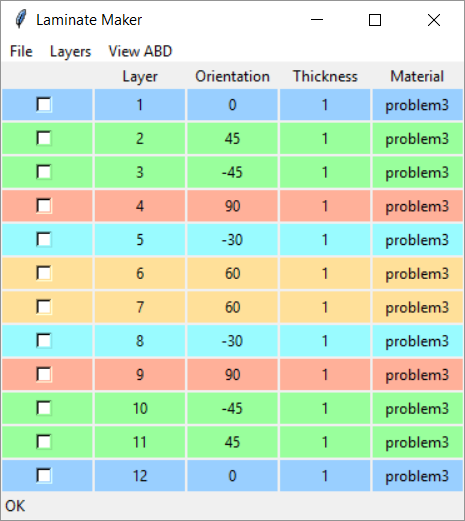

# Composites

made for the MAE 472 Composites course

## A Tkinter Application

Design composite laminates and compute their properties.

### Define Laminate Stack-Ups

### View ABD Matrices

### Create Ply Materials

### View Q Matrix Rotations

### Manage with Minimalist File Browser
